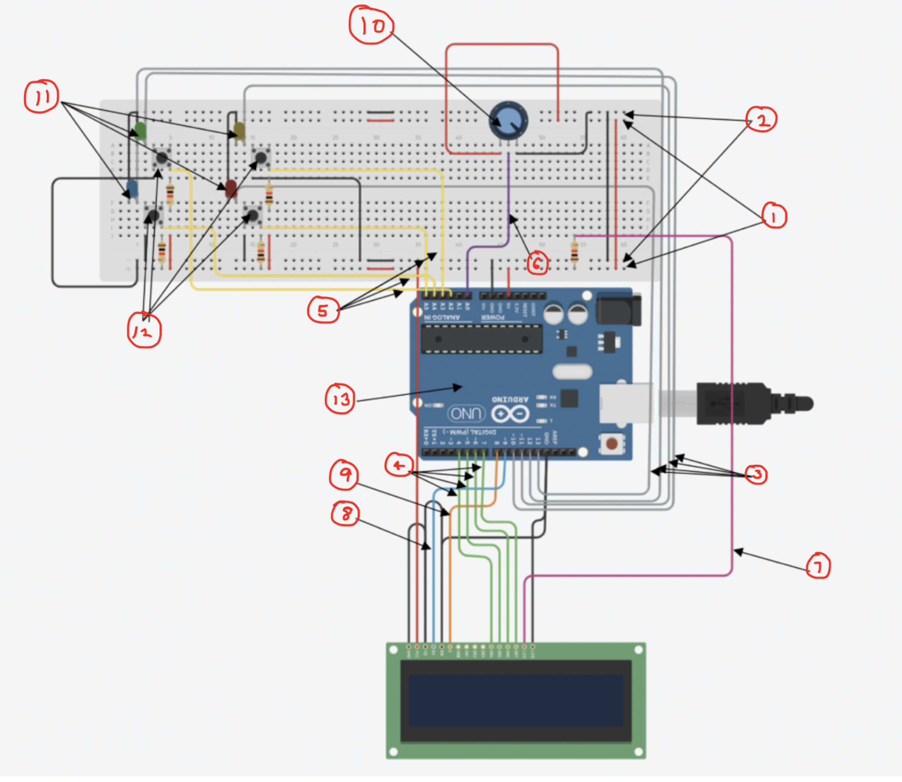

# CAB202-Whack-A-Box

- This repository contains the code for the invention, design, implementation and demonstration of a working prototype of a microcontroller-based product. The invention that has been explored is a game called “Whack-The-Box” which is a spin- off of the classic arcade game, Whack-A-Mole. This project was done in the C programming language.
---
### Skills gained at the completion of the project
- Understanding the basics of electronics and the interaction between hardware and software.
- Skills such as PWM, Analog I/O, Digital I/O, Serial I/O, Timers and LCDs.
---
### Installation/Use instructions
-   This can be loaded onto tinkercad to be run.
-   Following the instructions on the LCD screen will allow for gameplay.
---
### Completed Project
- Given below is a working diagram of the set up for the arduino and the circuit set up

---
### Notes about the Project
- Further testing and improvments to make game more appealing can be made.
---

https://user-images.githubusercontent.com/71302996/151764291-4f253ae1-725a-4253-886b-97f7880a6b60.mp4

